# ⚡ Energy Utility Forecaster Dashboard 

## Introduction
The **Energy Utility Forecaster Dashboard** is an interactive, Streamlit-based web application designed to help users track historical energy consumption (gas and electricity), predict future usage, and forecast financial utility costs. 

By uploading a standardised utility ledger, users can leverage advanced predictive time-series models to project future consumption and cost profiles. Furthermore, the dashboard allows users to run real-time "what-if" scenario simulations—adjusting future usage rates and tariff pricing—to instantly see how changing variables impact their bottom line and yearly energy summaries.

### Running the Application
To launch the interactive dashboard locally, ensure your terminal is in the project directory and run the standard Streamlit start command:

  streamlit run app.py

(Note: If your main application file is named differently, such as main.py, simply replace app.py with your specific file name).

Once executed, Streamlit will automatically open a new tab in your default web browser displaying the dashboard.

---

## 🚀 Getting Started

### Prerequisites
Ensure you have Python installed on your system. All required Python libraries and dependencies needed to run this application are listed in the `requirements.txt` file located in the root directory.

### Installation
1. Clone this repository to your local machine.
2. Open your terminal or command prompt, navigate to the project root folder, and install the dependencies by running:
```bash
pip install -r requirements.txt
```

---

## 📖 User Documentation

### 🎥 Live Application Preview
<p align="center">
  <video src="https://raw.githubusercontent.com/raul-villar-ai/Energy-Utilities-Forecasting-Tool/main/assets/demo.mp4" width="800px" controls autoplay loop muted></video>
</p>

### 📥 Step 1: Download Utility Ledger Template
<p align="center">
  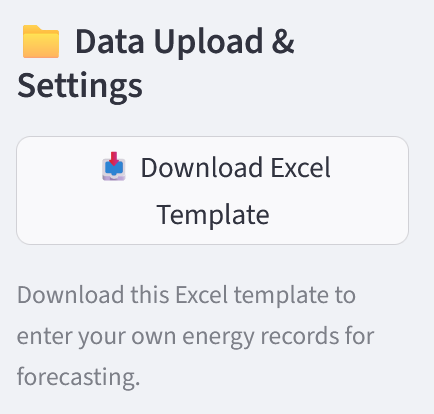
</p>

---

### 📥 Step 2: Open Downloaded Utility Ledger Template
<p align="center">
  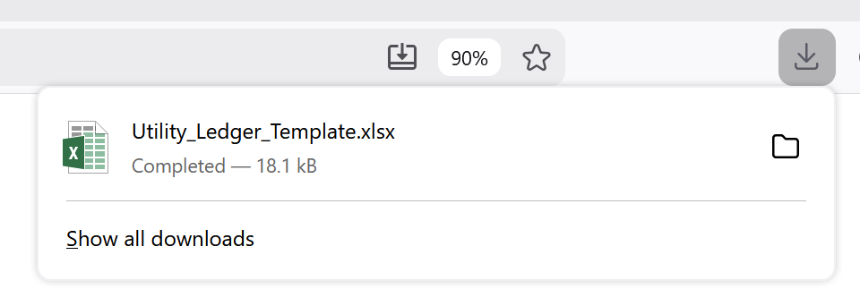
</p>

---

### 📥 Step 3: Select Units Parameter Values
<p align="center">
  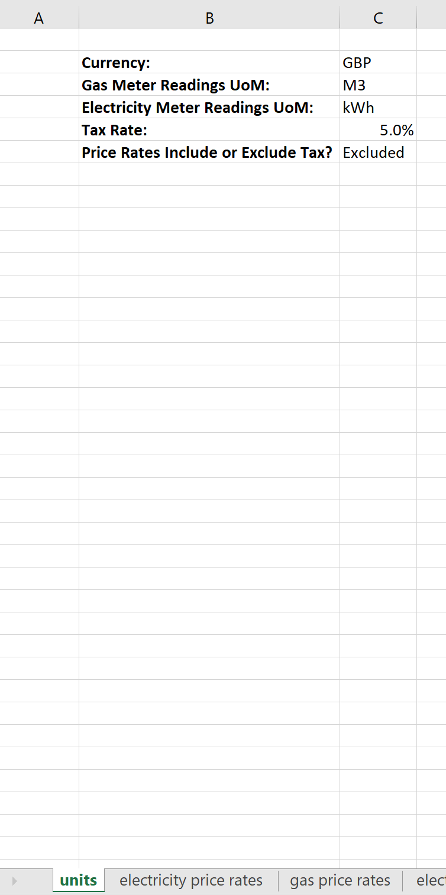
</p>

---

### 📥 Step 4: Enter Electricity Price Rates
<p align="center">
  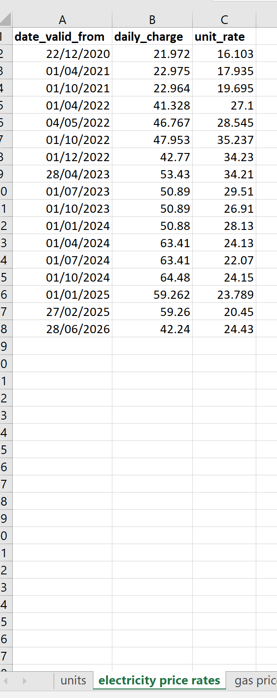
</p>

---

### 📥 Step 5: Enter Gas Price Rates
<p align="center">
  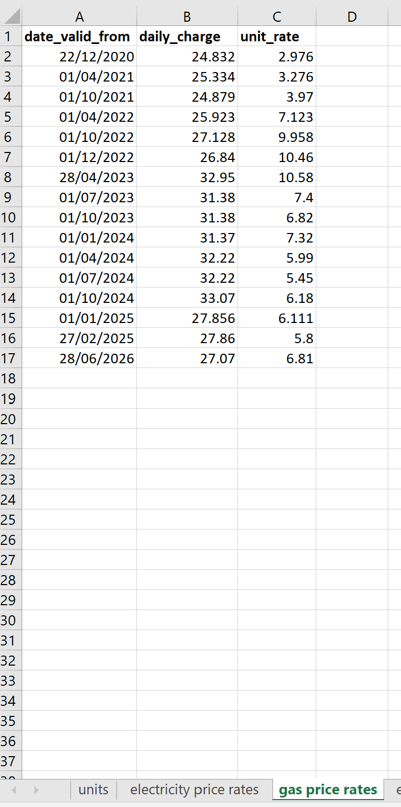
</p>

---

### 📥 Step 6: Enter Electricity Readings
<p align="center">
  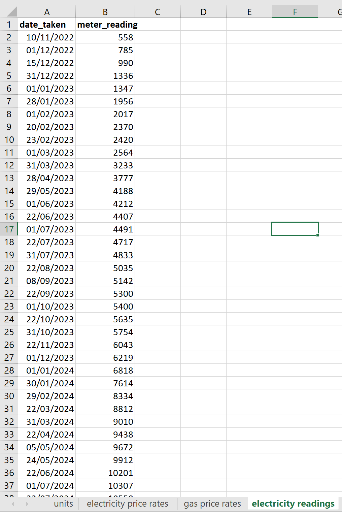
</p>

---

### 📥 Step 7: Enter Gas Readings
<p align="center">
  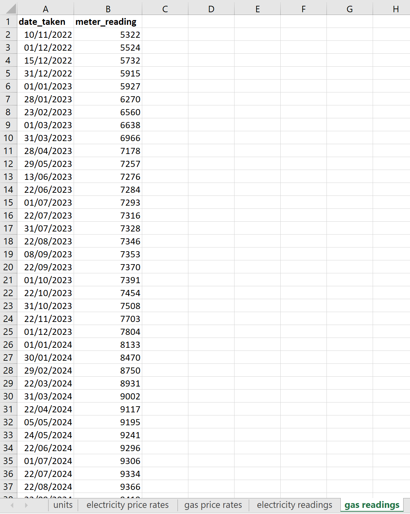
</p>

---

### 📤 Step 8: Upload Ledger
<p align="center">
  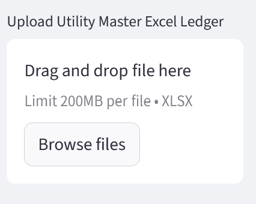
</p>

---

### 🤖 Step 9: Model Selection
<p align="center">
  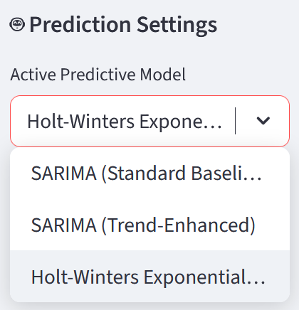
</p>

---

### 📈 Step 10: High-Level Statistics
<p align="center">
  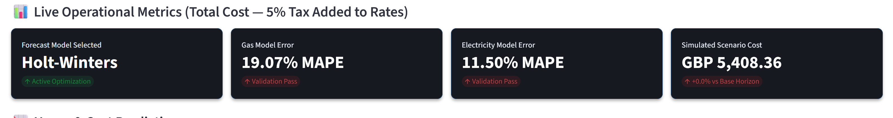
</p>

---

### 🎛️ Step 11: Volumetric Consumption Forecasts
<p align="center">
  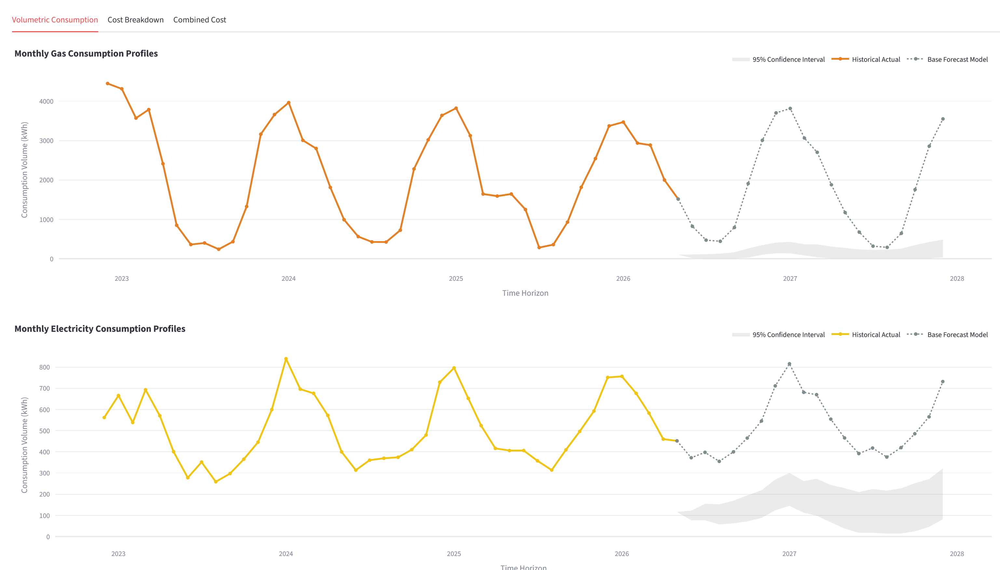
</p>

---

### 🎛️ Step 12: Cost Forecasts
<p align="center">
  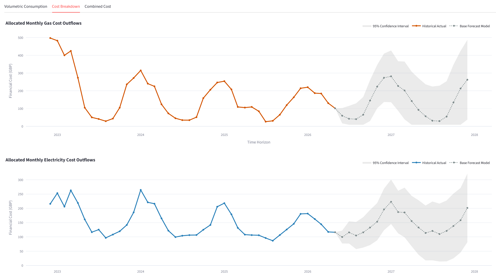
</p>

---

### 🎛️ Step 13: Aggregated Cost Forecast and Yearly Summary
<p align="center">
  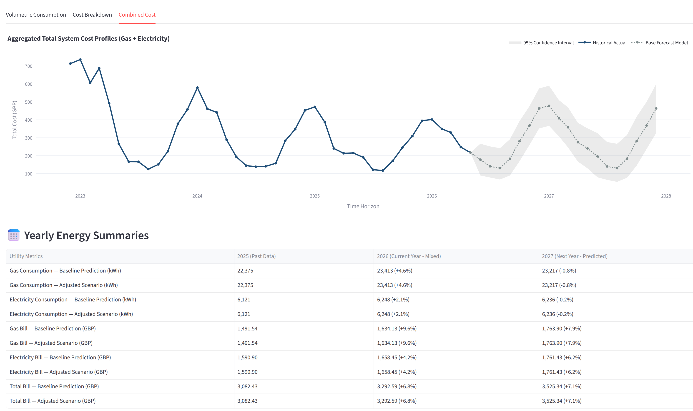
</p>

---

### 🎛️ Step 14: Forecast Adjustment Scenario Sliders
<p align="center">
  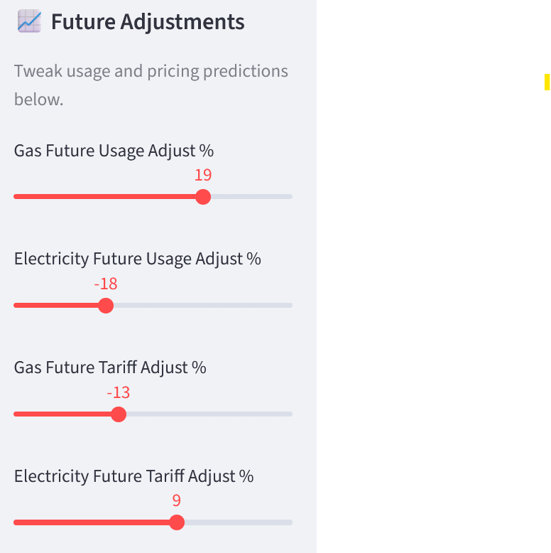
</p>

---

### 🎛️ Step 15: Volumetric Forecast with Adjustments
<p align="center">
  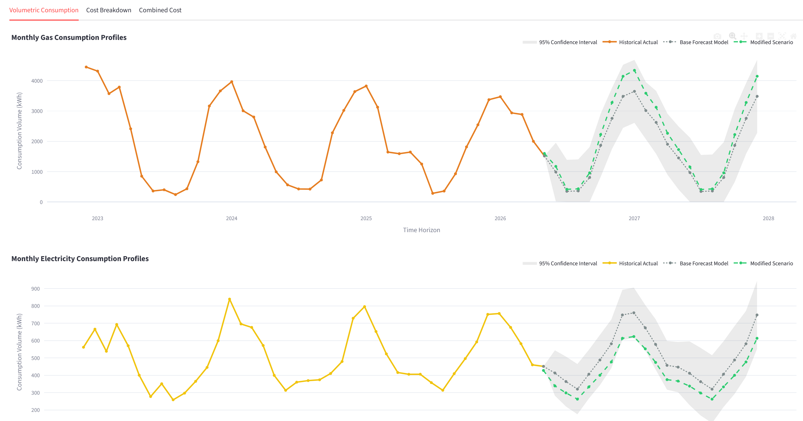
</p>

---

### 🎛️ Step 16: Combined Costs Forecast and Summary Table with Adjustments
<p align="center">
  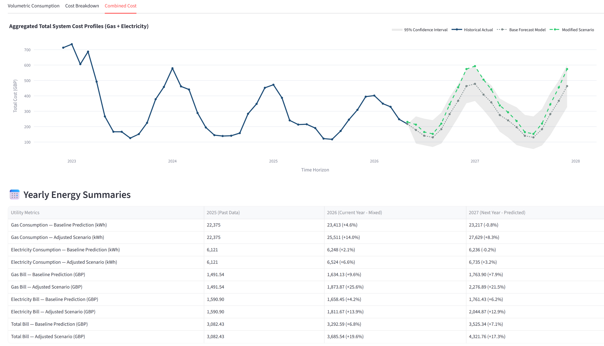
</p>

---